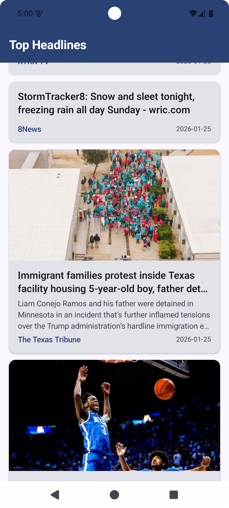

# 📰 Android News App

A **production‑ready Android News application** built with **Kotlin** and **Jetpack Compose**, designed to demonstrate **modern Android architecture**, **offline‑first data strategies**, and **industry‑standard testing practices**.

This project reflects how a real‑world Android app is structured, built, and tested in 2026.

## ✨ Key Features

* 📱 **Single‑Activity Architecture** using Jetpack Compose
* 🏗️ **MVVM Architecture** with strict separation of concerns
* 🔄 **Reactive UI** powered by `StateFlow`
* 🌐 **Offline‑First Design** with Room caching and network refresh
* 🎨 **Material 3 UI** with dynamic colors & dark mode support
* 📦 **Product Flavors** – `dev`, `staging`, and `prod`
* 🧪 **Robust Unit Testing** for ViewModels and Repositories

## 🏛️ Architecture Overview

The app follows **Clean MVVM architecture**, ensuring scalability, testability, and maintainability.

```
UI (Jetpack Compose)
┌─────────────────────────────────────────┐
│ NewsListScreen | NewsDetailScreen        │
└──────────────┬──────────────────────────┘
               │ StateFlow
               ▼
┌─────────────────────────────────────────┐
│ ViewModels                               │
│ NewsListViewModel                        │
│ NewsDetailViewModel                      │
└──────────────┬──────────────────────────┘
               │
               ▼
┌─────────────────────────────────────────┐
│ Repository                               │
│ NewsRepositoryImpl                       │
└──────┬──────────────────┬───────────────┘
       │                  │
       ▼                  ▼
┌─────────────┐     ┌──────────────┐
│ Remote Data │     │ Local Data   │
│ Retrofit    │     │ Room DB      │
└─────────────┘     └──────────────┘
```

📸 Screenshots
<p align="left">
  
  &nbsp;&nbsp;&nbsp;
  
</p>

### Tools & Libraries
* **JUnit 4** – Unit testing framework
* **Turbine** – Flow and StateFlow testing
* **kotlinx‑coroutines‑test** – Coroutine control
* **MockK** – Minimal mocking where required

### Testing Approach

* ViewModels tested with controlled coroutine dispatchers
* Repositories tested using **fake data sources**, not heavy mocks
* Deterministic tests with `runTest`

## 🚀 Getting Started

### 1. Obtain API Key

* Register at [https://newsapi.org](https://newsapi.org)
* Add your API key to the appropriate `local.properties` or build config

```bash
# Run all unit tests
./gradlew test

# Run flavor‑specific tests
./gradlew testDevDebugUnitTest

# Generate coverage report
./gradlew testDebugUnitTest jacocoTestReport
```

## 📦 Product Flavors

The project is configured with multiple environments to mirror real‑world workflows:

| Flavor  | Purpose             |
| ------- | ------------------- |
| dev     | Local development   |
| staging | QA / pre‑production |
| prod    | Production release  |

### Build Commands

```bash
# Install dev build
./gradlew installDevDebug

# Install staging build
./gradlew installStagingDebug

# Assemble production release
./gradlew assembleProdRelease

./gradlew installDebug  # Defaults to dev
```

**Built with ❤️ using Kotlin & Jetpack Compose**
